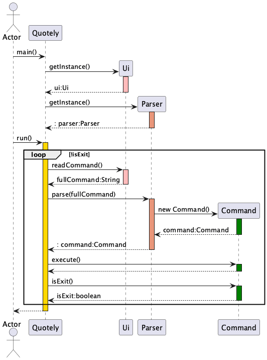
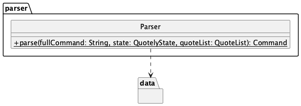
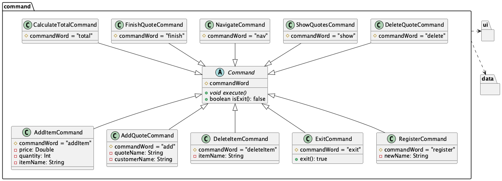
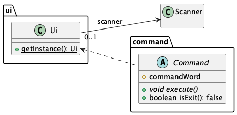
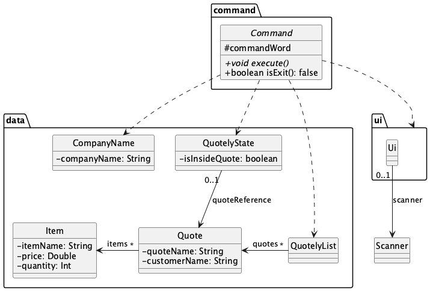

# Developer Guide

## Acknowledgements

{list here sources of all reused/adapted ideas, code, documentation, and third-party libraries -- include links to the original source as well}

## Design & implementation

{Describe the design and implementation of the product. Use UML diagrams and short code snippets where applicable.}

###  Architecture

### Paarser Component

#### Command Component

#### Ui Component

#### Data Component

## Product scope
### Target user profile

{Describe the target user profile}

### Value proposition

{Describe the value proposition: what problem does it solve?}

### User Stories

|Version| As a ... | I want to ... | So that I can ...|
|--------|----------|---------------|------------------|
| v1.0 | sales worker | add items to quote | keep track of items in the quote | 
| v1.0 | sales worker | delete item from quote | keep track of items in the quote and get rid of wrong or outdated info |
| v1.0 | small online merchant that uses whatsapp and telegram to quote customers | generate invoices in text form | save time typing the full format |
| v1.0 | new user | view my quotations and sales| have better oversight of my own work |
| v1.0 | sales worker | auto sum the total amount and calculate the tax | send a finished quote |

## Non-Functional Requirements

{Give non-functional requirements}

## Glossary

* *glossary item* - Definition

## Instructions for manual testing

{Give instructions on how to do a manual product testing e.g., how to load sample data to be used for testing}

## Documentation, logging, testing, configuration, dev-ops

- [Logging guide](./Logging.md)
- [Diagram guide](./DiagramGuide.md)